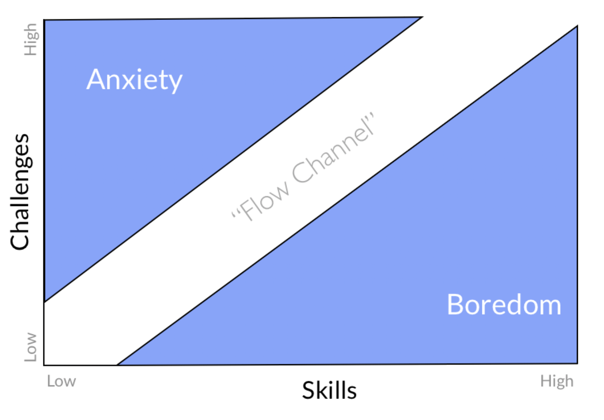
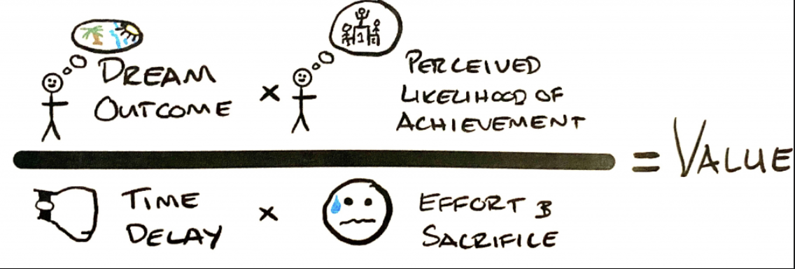

# Charts

## The funnel

- Path for generating **leverage** and increasing **freedom**

1. **Find a flow related activity that you can get paid to do**: if you can do a job that you enjoy and does not feel like work this is a good start. But first you need to develop the skills. This probably shouldn't be a case of "follow your passion" but rather find something you are interested in that will pay well and can achieve high amounts of leverage.
2. **Get paid to do the activity**: Obvious, but important step. If you enjoy the work and get paid well you could just stop here for ever. Or continue up the funnel...
3. **Location independence** (optional): Generally if you have location freedom you are more free in general...but I guess it's not for everyone. This could be achieved through remote work or starting your own venture.
4. **Financial independence**: This is where leverage matters. Leverage can be achieved through 3 mechanisms

    - **Managing people**: oldest hardest form (Egyptian pyramids, Rockerfeller etc.)
    - **Managing capital**: all the great fortunes of 20th century (Buffet, Dalio etc.). Requires some capital to start
    - **Code/media**: newest and largest form of leverage, permission-less. All the newest fortunes (Zuck, Bezos, Rogan etc.)

## Flow

- Chart describing why flow activities lead to **growth** and **discovery**
- Every action performed in life fits somewhere on the graph

## The offer

- Equation describing how value is created
- Price is what you **pay**, value is what you **receive**
- Equation summarises the four elements that are involved in creating value
- To increase value **increase** dream outcome and perceived likelihood of success, and **decrease** time to achieve and effort/sacrifice

