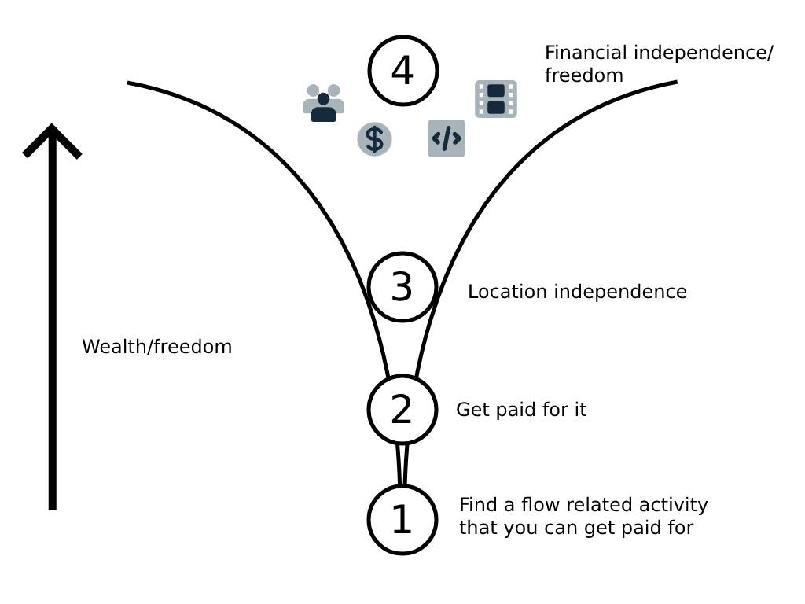

# Charts

## The funnel

- Path for generating **leverage** and increasing **freedom**

## Flow

- Chart describing why flow activities lead to **growth** and **discovery**
- Every action performed in life fits somewhere on the graph

## The offer

- Equation describing how value is created
- Price is what you **pay**, value is what you **receive**
- Equation summarises the four elements that are involved in creating value
- To increase value **increase** dream outcome and perceived likelihood of success, and **decrease** time to achieve and effort/sacrifice

