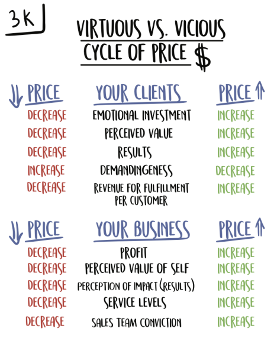
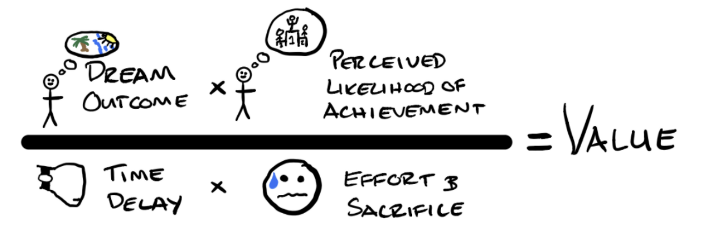

# Offers

## The Process

1. Define the dream outcome
2. List *all* the client's possible problems
3. Split each problem based on the value equation
4. Convert problems into solution wording i.e. it will be to hard -> how to make it less hard
5. Think of solutions using the delivery cube
6. Determine if each solution is high value or low value, and high cost or low cost
7. Make sure each problem has a solution, if a problem has multiple solutions choose the higher value one
8. Reserve the hardest hitting high value, high cost items (max 2 or 3)

## Chapters

## 1. Markets

### Needs to have

- Pain
- Purchasing power
- Easy to target
- Growing

'Help a unique avatar. Solve a specific problem. In a unique way. That reverses their biggest fear or objection.'

'The riches are in the niches -> Same product x100 price.'

'The goal of great *writing* is for the reader *to understand*.'

'The goal of great *copy* is for the reader *to feel understood*'

## 2. Pricing

### Price to value discrepancy

Price is what you *pay*, value is what you *get*

If perceived *value* > price = happy customer

Therefore 2 options:

1. Increase value (easier unlimited up)
2. Decrease price (harder limited to 0)

### Virtuous pricing cycle

Normally:

- Pick below the highest competitor to "be competitive"
- Value proposition -> more for less
- Pricing for market efficiency -> race to the bottom

### Charge what it's worth - new price

- Make price so disconnected from market that people pause
- Higher price = higher value e.g. wine example
- *Must be something different* - category of one
- Higher prices get people better results

## 3. Value Equation

1. *Dream outcome* - Is the end result meaningful *to them*
2. *Perceived likelihood* - Risk reduction/Credibility
3. *Time delay* - how long will it take for the final result/progress. (Incorporate short term immediate wins)
4. *Effort or sacrifice* - how can I make it easier

## 4. The delivery vehicle - 'the how'